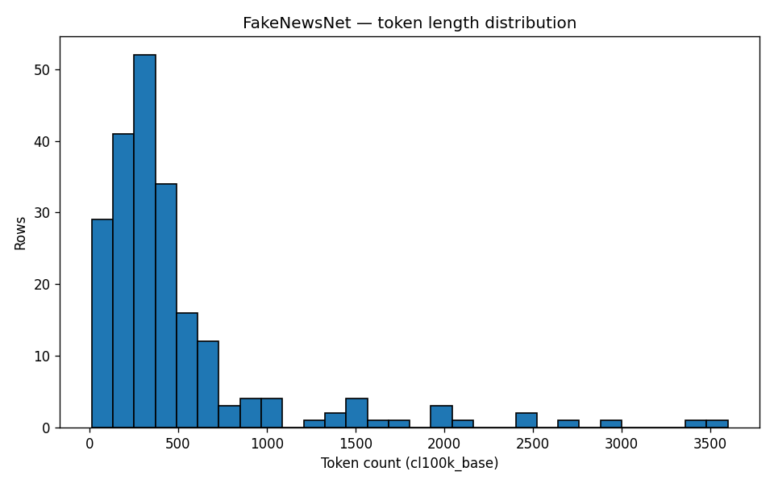
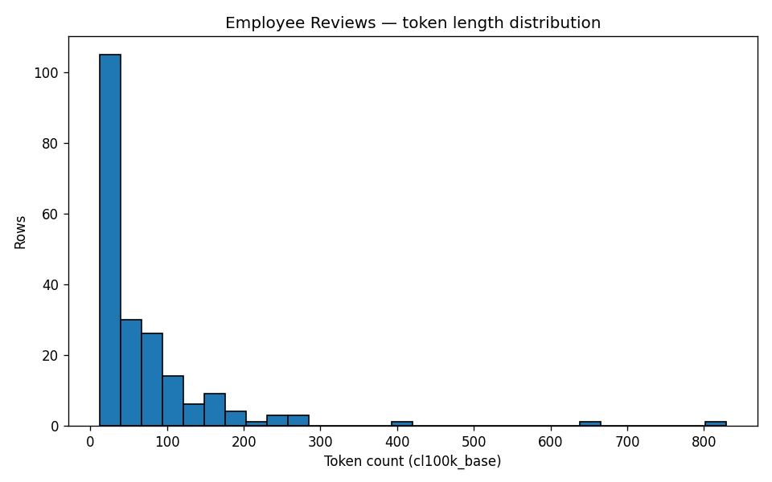

# Phase 1 — Data summary

Generated: 2026-05-19T17:52:56.363166+00:00

## FakeNewsNet (sample.parquet)
- Rows: 214
- Class balance:
  - `fake`: 107 (50.0%)
  - `real`: 107 (50.0%)
- Token length: mean=495.1, median=338.0, p95=1692.6, max=3598
- Random sample (5 rows, text truncated 200 chars):
  - `fnn_hf_000215` [real]: 'The Pain Caucus, a group advocating for policies that prioritize creditor interests, continues to dominate economic decision-making in the face of changing justifications for imposing austerity measur'
  - `fnn_hf_000211` [real]: 'A recent discovery has raised concerns among users regarding the privacy practices of popular news outlet POLITICO. By signing up on the website, users unknowingly grant POLITICO the permission to col'
  - `fnn_hf_000123` [fake]: 'UI Notice: The comments were found not to be true. PHEEEEEWWWW, that would have been too much to handle.  Houston – It seems new National Rifle Association President (NRA) president Jim Porter may hav'
  - `fnn_hf_000280` [real]: 'April 18, 2010 — Former President Bill Clinton recently granted an exclusive interview with "This Week," where he addressed various topics including his mistakes as president, the dangers of political'
  - `fnn_hf_000488` [real]: 'Enslaved laborers participated in every stage of building construction, from the quarrying and transportation of stone to the construction of the Executive Mansion. They worked alongside European craf'

- Source: HuggingFace `Jinyan1/PolitiFact` (primary) or KaiDMML/FakeNewsNet CSVs (fallback).

## Employee Reviews (labeled.parquet)
- Rows: 204
- Class balance:
  - `not_mentioned`: 95 (46.6%)
  - `remote`: 57 (27.9%)
  - `not_remote`: 52 (25.5%)
- Token length: mean=69.4, median=39.0, p95=195.6, max=829
- Random sample (5 rows, text truncated 200 chars):
  - `er_97cbbb8deb66` [not_mentioned]: 'Great Company Amazing resources, Great mentorship and Nice Office Building. Pay and Benefits could be better.'
  - `er_2af20266355b` [remote]: 'Good WFH option is good. Flexible Nothing found so far.'
  - `er_6bce1036ea26` [not_remote]: 'Great for an Interim job Great Benefits, good pay when hired Not Remote friendly, raises are scarce despite huge company profits'
  - `er_7ed180acdadc` [not_mentioned]: "The Times Top 100 companies to work for It's a dynamic and fast paced environment to work!  Talented workforce from the around the different markets it seems are uniting at The Access Group.  One of t"
  - `er_4b3e3aa1516f` [remote]: 'Package Solution Consultant Good Management, Work From Home,  Submitting the work on time is important rather than being present in office for 8 hrs Slow growth rate, negligible salary increments'

- Source: Kaggle `davidgauthier/glassdoor-job-reviews` v1 (manually downloaded).
