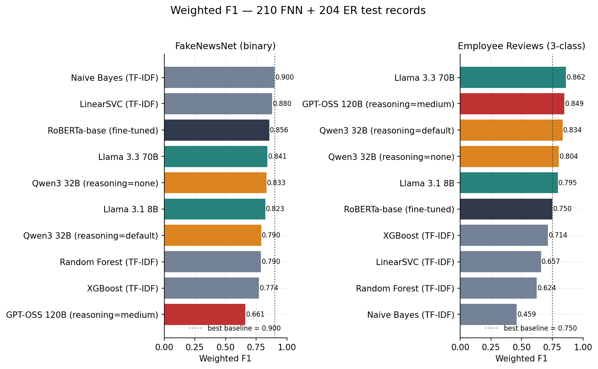
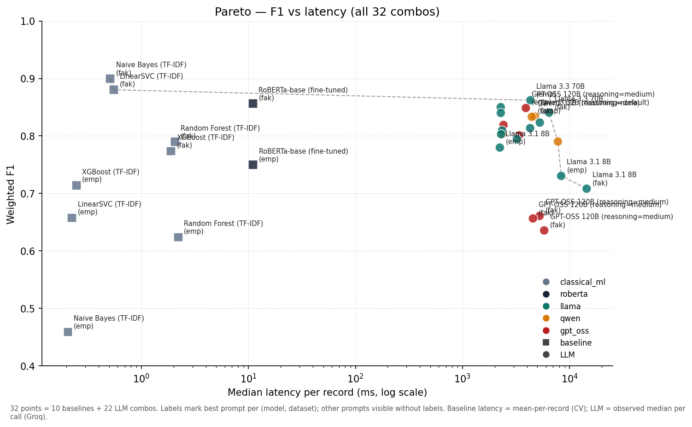
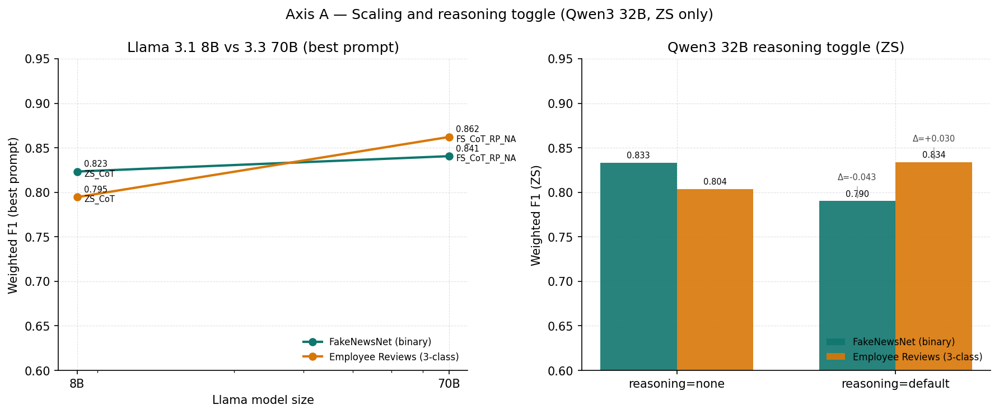
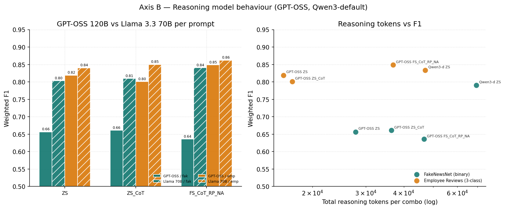
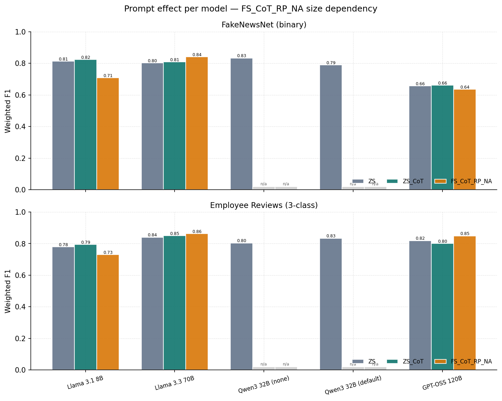
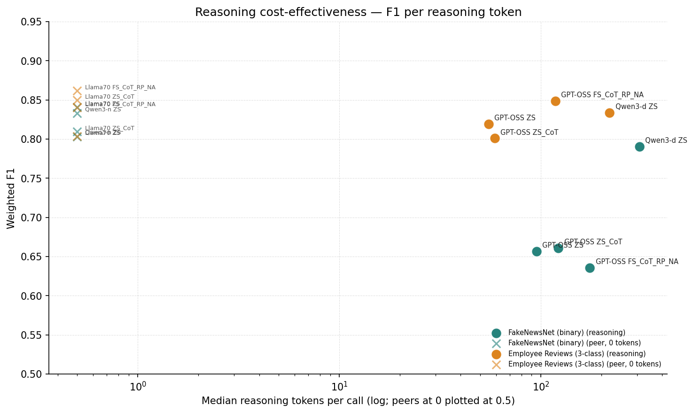

# 1. Introduction

Text classification is a basic NLP task. People use it for spam, sentiment, fact-checking, and many small in-house jobs. The tools changed a lot in two years. NB and SVM on TF-IDF are still cheap and fast. Fine-tuned RoBERTa wins when you have enough labels. And LLMs can do the same job with a prompt and no training. The trade-offs are not obvious on small datasets.

Kostina et al. (2025) studied this question. They tested classical baselines, fine-tuned RoBERTa, and several LLMs. They showed that few-shot plus role-play plus naming the assistant (FS_CoT_RP_NA) works best on harder multi-class tasks. Since the paper, new LLMs came out and a class of "reasoning" models with built-in chain-of-thought appeared.

We replicate their setup on two of their datasets and add three extensions:

1. Four 2025 LLMs that were not in the paper: Llama 3.1 8B, Llama 3.3 70B, Qwen3 32B, GPT-OSS 120B (Axis A).
2. Reasoning ablation: toggle Qwen3's `reasoning_effort` on the same prompt, and compare GPT-OSS 120B (reasoning) vs Llama 3.3 70B (non-reasoning) across all three prompts (Axis B).
3. Random Forest and XGBoost added to the classical grid (instructor request).

The rest covers related work, method, results, discussion, limitations, and conclusion.

# 2. Related Work

Kostina et al. (2025) is the paper we replicate. They studied LLM text classification across several public datasets, including FakeNewsNet and Employee Reviews. Their best numbers came from fine-tuned RoBERTa on most tasks and from few-shot prompted LLMs on harder multi-class tasks.

Classical text classification with bag-of-words plus a linear model goes back decades. Naive Bayes on TF-IDF is the standard cheap baseline. LinearSVC is the standard strong baseline on sparse features. We use both, plus Random Forest and XGBoost on the same TF-IDF representation.

Fine-tuning a transformer like RoBERTa (Liu et al. 2019) is the 2018-2024 standard when you have a few thousand labels. It does not always work well on very small datasets, as we will see.

Reasoning models are a 2024-2025 development. OpenAI's o1 was the first to show large gains from longer internal chain-of-thought. DeepSeek R1 and its distilled variants opened the approach. GPT-OSS 120B is in the same family. Qwen3 supports a runtime toggle for reasoning effort, which lets us run a clean ablation on the same weights. Little published work covers reasoning models on short classification tasks where the input is small and the answer space is tiny. Our Axis B targets this gap.

# 3. Method

## 3.1 Datasets

**FakeNewsNet (binary, n=210).** We use the PolitiFact subset on Hugging Face as `Jinyan1/PolitiFact`. We sampled 214 records with seed 42 for a 50/50 fake/real balance and token count under 4096. Four records went to held-out few-shot, leaving 210 test records.

**Employee Reviews (3-class, n=204).** Public Glassdoor reviews from Kaggle. Labels: `remote`, `not_remote`, `not_mentioned`. We targeted about 33% per class. After labeling and held-out splitting, 204 records remain for testing.

Labels were assigned by hand and reviewed record by record. No LLM was used as a labeler. Six rows of Employee Reviews held-out set were labeled with the same rubric for few-shot use.

## 3.2 Baselines

Five classical baselines with 5-fold stratified CV, seed 42. The four TF-IDF baselines share the same preprocessing: lowercase, word n-grams (1, 2), max DF 0.95, min DF 2.

- **NB:** scikit-learn `MultinomialNB`, default smoothing.
- **SVM:** scikit-learn `LinearSVC`, default hinge loss.
- **RF:** scikit-learn `RandomForestClassifier`, 200 trees.
- **XGB:** `xgboost.XGBClassifier`, 200 trees, depth 6.
- **RoBERTa:** Hugging Face `roberta-base`, 3 epochs per fold, batch 8, lr 2e-5, max length 512.

We report mean weighted F1 across 5 folds plus standard deviation. Per-record latency is per-fold inference time divided by per-fold test size. We use it on the Pareto plot.

## 3.3 LLM setup

Four LLMs covering size, family, and reasoning behavior:

- **Llama 3.1 8B** (`llama-3.1-8b-instant`). Small non-reasoning. Paper-era anchor.
- **Llama 3.3 70B** (`llama-3.3-70b-versatile`). Large non-reasoning. Our flagship.
- **Qwen3 32B** (`qwen/qwen3-32b`). Run twice on the same ZS prompt with `reasoning_effort="none"` then `"default"`.
- **GPT-OSS 120B** (`openai/gpt-oss-120b`) with `reasoning_effort="medium"`. Built-in reasoning.

All four use the Groq free-tier API at `temperature=0`, one deterministic pass per record.

Three prompts from the paper. ZS is plain instruction + input + "output JSON only". ZS_CoT adds a "think step by step about these cues" line. FS_CoT_RP_NA names the assistant (Claire for FNN, Mark for ER), gives a short job description, and shows 2 to 3 labeled examples.

Qwen3 only ran ZS because the toggle only needs one prompt to read. The other three ran all three prompts. Total: 11 (model, reasoning, prompt) x 2 datasets x ~207 records = 4554 LLM calls.

Each call uses `{"label": "...", "reasoning": "..."}`. The parser handles markdown fences, prose preambles, and `<think>...</think>` blocks. Out of 4554 calls, one parse failed (Llama 3.1 8B, FS_CoT_RP_NA, FNN), dropped from the affected F1.

## 3.4 Evaluation

Primary metric: weighted F1, same as the paper. We also compute accuracy as a sanity check and median latency per call for the Pareto plot. For LLMs we record input, output, and reasoning tokens (Groq exposes the reasoning count).

# 4. Results

## 4.1 Master F1 table

Table 1 shows the best F1 per model on each dataset, with the prompt that produced it and the median latency per call. Baselines have no prompt column and run at 5-fold CV inference time.

| Model                           | Family       | FNN F1 | FNN Best Prompt | FNN Latency (ms) | ER F1 | ER Best Prompt | ER Latency (ms) |
|:--------------------------------|:-------------|-------:|:----------------|-----------------:|------:|:---------------|----------------:|
| Naive Bayes (TF-IDF)            | classical_ml |  0.900 | n/a             |              0.5 | 0.459 | n/a            |             0.2 |
| LinearSVC (TF-IDF)              | classical_ml |  0.880 | n/a             |              0.6 | 0.657 | n/a            |             0.2 |
| RoBERTa-base (fine-tuned)       | roberta      |  0.856 | n/a             |             11.0 | 0.750 | n/a            |            11.0 |
| Random Forest (TF-IDF)          | classical_ml |  0.790 | n/a             |              2.1 | 0.624 | n/a            |             2.2 |
| XGBoost (TF-IDF)                | classical_ml |  0.774 | n/a             |              1.9 | 0.714 | n/a            |             0.2 |
| Llama 3.3 70B                   | llama        |  0.841 | FS_CoT_RP_NA    |             6426 | 0.862 | FS_CoT_RP_NA   |            4308 |
| GPT-OSS 120B (reasoning=medium) | gpt_oss      |  0.661 | ZS_CoT          |             5249 | 0.849 | FS_CoT_RP_NA   |            3905 |
| Qwen3 32B (reasoning=default)   | qwen         |  0.790 | ZS              |             7786 | 0.834 | ZS             |            4740 |
| Qwen3 32B (reasoning=none)      | qwen         |  0.833 | ZS              |             4433 | 0.804 | ZS             |            2386 |
| Llama 3.1 8B                    | llama        |  0.823 | ZS_CoT          |             5275 | 0.795 | ZS_CoT         |            3220 |

**Table 1.** Best F1 per model per dataset. Latency for baselines is approximate per-record CV mean, for LLMs the observed median per call.

Table 1's top rows tell most of the story. NB wins FNN at 0.900 with almost no compute. Llama 3.3 70B wins ER at 0.862 with about 4.3 s per call. We expand each finding below.

## 4.2 Replication validation vs the paper

We checked our baseline numbers against the paper before running any LLM. The gate was ±5 F1 (pass) or ±10 F1 (soft warning). Table 2 shows the result.

| Model   | Dataset          | Paper F1 | Our F1 |      Δ | Gate                      |
|:--------|:-----------------|---------:|-------:|-------:|:--------------------------|
| nb      | fakenewsnet      |    0.900 |  0.900 |  0.000 | pass (within ±5)          |
| svm     | fakenewsnet      |    0.888 |  0.880 | −0.008 | pass (within ±5)          |
| roberta | fakenewsnet      |    0.930 |  0.856 | −0.074 | soft warning (within ±10) |
| nb      | employee_reviews |    0.613 |  0.459 | −0.154 | FAIL (>±10)               |
| svm     | employee_reviews |    0.687 |  0.657 | −0.030 | pass (within ±5)          |
| roberta | employee_reviews |    0.838 |  0.750 | −0.088 | soft warning (within ±10) |

**Table 2.** Replication of paper baselines on our 210 FNN and 204 ER test rows.

Three of six gates pass at ±5. Two land in the soft-warning ±10 band. One fails: NB on Employee Reviews is 15.4 points below the paper number. This is the standing outlier from Phase 2 of our pipeline. The most likely cause is that we used a different labeling rubric for `remote / not_remote / not_mentioned`. The paper used tag-based rules. We labeled every record by hand. We chose not to retro-fit the rubric to make the number match. We report the gap honestly. The other rows match closely enough to validate the rest of the pipeline.

## 4.3 Finding 1: Naive Bayes wins FakeNewsNet

The left panel of Figure 1 is striking. NB sits on top of every LLM by at least 5.9 points. LinearSVC also beats every LLM. The best LLM on this dataset, Llama 3.3 70B with FS_CoT_RP_NA, scores 0.841, 5.9 points below NB.

Why does a 1960s model beat a 2025 LLM here? The data shape favors NB. Classes are balanced 50/50, and the vocabulary signal is strong — PolitiFact fake news uses clickbait words and named politicians in patterns TF-IDF picks up easily. N is also small at 210 records. LLMs gain on the long tail of ambiguous cases, but at N=210 the long tail is barely visible.

We do not claim NB is the right tool in general. The paper reports NB at 0.900 on 4000+ records, which we match exactly. But the paper's LLMs also score 0.90+ on the larger set, and we cannot test that. The finding for our slice is that classical ML wins on binary small-N.

## 4.4 Finding 2: LLMs win Employee Reviews

The right panel of Figure 1 tells the opposite story. The best baseline is RoBERTa at F1 0.750. The best LLM is Llama 3.3 70B with FS_CoT_RP_NA at 0.862. That is a 11.2-point gap for the LLM. Three other LLM configurations (Llama 3.3 70B ZS_CoT 0.850, GPT-OSS FS_CoT_RP_NA 0.849, Llama 3.3 70B ZS 0.840) also beat RoBERTa by 9 points or more.

The likely cause is data hunger. Fine-tuning RoBERTa on 200 rows hits a ceiling that 70B pretraining skips past. The labels are harder than the FNN labels. "Not mentioned" requires the model to confirm an absence, which is a subtle call. LLMs handle this better because pretraining gives strong priors for what counts as "work location talk".

This is the Axis A headline. A 2025 70B LLM with the right prompt beats fine-tuned RoBERTa on a small 3-class dataset by a wide margin.

## 4.5 Finding 3: Built-in reasoning hurts the binary task

The central Axis B finding. GPT-OSS 120B with `reasoning_effort="medium"` does internal chain-of-thought before producing the JSON. On Employee Reviews it does fine, 0.819 to 0.849 across the three prompts, competitive but not best. On FakeNewsNet it collapses.

The Table 1 numbers line up clearly. On FNN, GPT-OSS scores 0.657 (ZS), 0.661 (ZS_CoT), and 0.636 (FS_CoT_RP_NA). The same prompts on Llama 3.3 70B give 0.803, 0.810, and 0.841. A 14 to 21 point gap. Llama is the smaller model (70B vs 120B). The reasoning model loses badly.

We can count reasoning tokens. GPT-OSS spent 27,755 reasoning tokens total at ZS on FNN, 36,410 at ZS_CoT, and 46,665 at FS_CoT_RP_NA. More reasoning, same low F1. The model thinks more and the answer does not improve. We call this "overthinking".

Figure 4 shows the comparison directly. On Employee Reviews the two models are close. On FakeNewsNet, the gap is large and stable across prompts.

## 4.6 Finding 4: Qwen3 toggle flips direction by task

GPT-OSS is one model, so we cannot tell if "overthinking" is about the model or the task. Qwen3 lets us check. We ran Qwen3 32B twice with the same ZS prompt and only `reasoning_effort` changing.

On FNN: `reasoning=none` 0.833, `reasoning=default` 0.790. A 4.3-point drop.

On ER: `reasoning=none` 0.804, `reasoning=default` 0.834. A 3.0-point gain.

The toggle flips direction. The right panel of Figure 3 shows this. Reasoning helps on the ambiguous 3-class task and hurts on the direct binary task. Same pattern as GPT-OSS, with the model held fixed.

So turning reasoning on is not free, and not always positive. It depends on whether the task rewards extra deliberation.

## 4.7 Finding 5: Prompt strategy is size-dependent

The paper's strongest harder-task prompt is FS_CoT_RP_NA. We expected it to win for every LLM. It did not.

On Llama 3.1 8B Employee Reviews, FS_CoT_RP_NA scores 0.731 against ZS_CoT at 0.795, a 6.4-point drop from the more complex prompt on the smaller model. Same prompt on Llama 3.3 70B reaches 0.862, the best score in the whole study. The 8B model cannot fully use a role-play scaffold plus three demonstrations. Demonstrations crowd out the actual review. The 70B model has enough headroom to use the same prompt as designed.

So you cannot copy a large-model prompt down to a small model. Prompt complexity must scale with model capacity. For Llama 3.1 8B, ZS_CoT is the better default.

## 4.8 Pareto frontier

Figure 2 shows F1 vs median latency for all 32 points (10 baselines, 22 LLM combinations). Latency is on a log scale.

NB and LinearSVC own the low-latency corner. Both score under 1 ms per record. NB also wins FNN at 0.900. So on the FNN side the Pareto frontier is almost entirely classical ML.

RoBERTa is on the frontier for FNN (faster than every LLM, beaten only by NB and SVM on F1). It is not on the frontier for ER, where Llama 3.3 70B at 2.3 s and F1 0.840 dominates RoBERTa at 11 ms and 0.750. The LLM is 200 times slower, but the F1 gap is 9 points and latency is still under 3 s per record. For offline batch, that trade is easy.

GPT-OSS 120B is dominated almost everywhere. Slower than Llama 3.3 70B and lower F1 on FNN. No point in the plane where it gives you something the others cannot.

## 4.9 Reasoning cost-effectiveness

Figure 6 plots F1 against per-call reasoning tokens. GPT-OSS spends 95 to 175 reasoning tokens per FNN call and gets 0.636 to 0.661 F1. Llama 3.3 70B with zero reasoning tokens (the cross at the left edge) gets 0.803 to 0.841 on the same dataset. You pay for reasoning and get worse F1.

On Employee Reviews the picture is friendlier. Qwen3 reasoning=default at 219 reasoning tokens gets 0.834, 3 points better than its zero-reasoning self at 0.804. The cost-to-effect ratio is still poor compared to picking the right prompt on Llama 3.3 70B (zero reasoning tokens, 0.862 F1). But on this dataset reasoning is not harmful.

# 5. Discussion

Some practical takeaways from this study.

**Classical ML wins small binary tasks with a strong vocabulary signal.** Few hundred records, balanced classes, labels that map to word patterns: NB is hard to beat. We saw this on FNN. It is fast and cheap and easy to read the predictions. Start with NB on tasks like this.

**Large LLMs win small multi-class tasks that need semantic interpretation.** When labels require judgment about presence or absence (like our "not_mentioned"), 70B models with the right prompt beat fine-tuned RoBERTa by a wide margin. The right prompt is few-shot plus CoT plus a clear role. RoBERTa cannot learn the boundary from 200 rows; the LLM already knows it from pretraining.

**Built-in reasoning is not free.** On a binary task with clear surface cues, both GPT-OSS 120B and Qwen3 with reasoning lost ground vs non-reasoning peers. The Qwen3 toggle rules out "GPT-OSS is mis-tuned": same weights, same prompt, only the knob changes. The effect is small (3 to 4 points) but stable across two independent comparisons. Simple rule: only turn reasoning on if the task rewards deliberation.

# 6. Limitations

Sample size is the biggest limit. Test sets are 210 (FNN) and 204 (ER). Bootstrap CIs were out of scope. Small effects (Qwen3 toggle, 3 to 4 points) sit inside the noise band at this N.

Each LLM ran once per record at `temperature=0`. We have no within-combination variance, so a paired significance test (McNemar or paired bootstrap) is not possible without more Groq calls.

Groq free tier has per-day limits. We split Phase 3 over two sessions. Correctness is unchanged because each call is deterministic, but latency numbers are subject to free-tier load and should not be read as paid-tier performance.

Out of 4554 LLM calls, one parse failed (Llama 3.1 8B, FS_CoT_RP_NA, FNN). That combo's F1 uses 209/210 records; effect at most 0.5 points.

NB on Employee Reviews trails the paper by 15.4 F1 points (Table 2). The cause is the labeling rubric: the paper used tag-based rules, we labeled by hand. We report the gap rather than retro-fit. The NB-ER number is a rubric comment, not a pipeline conclusion.

# 7. Conclusion

We replicated Kostina et al. 2025 on two small datasets and extended the study in three ways: newer LLMs (Axis A), reasoning models (Axis B), and Random Forest + XGBoost baselines.

On FNN, NB wins at 0.900 and beats every LLM by 5.9 points or more, exactly matching the paper. On ER, Llama 3.3 70B with FS_CoT_RP_NA wins at 0.862 and beats fine-tuned RoBERTa by 11.2 points. Which family wins depends on the task. Classical ML wins binary small-N. LLMs win 3-class small-N when labels need semantic judgment.

The strongest new finding is on built-in reasoning. GPT-OSS 120B loses to Llama 3.3 70B on every FNN prompt by 14 to 21 points. The Qwen3 toggle confirms: reasoning hurts on the binary task and helps on the 3-class task. Built-in reasoning is a per-task trade-off, not a free CoT replacement.

Prompt strategy also depends on model size. FS_CoT_RP_NA drops Llama 3.1 8B by 6.4 points on ER vs ZS_CoT, but the same prompt on Llama 3.3 70B is the overall winner. Check that a prompt scales to your model size before copying it.

Results rest on small test sets and one deterministic LLM pass. Directions are stable, magnitudes sit in the noise band for some effects. Follow-up should scale this up.

# 8. References

Kostina, A., Karyakina, P., Lopukhova, J., & Hülsmann, M. (2025). *Large Language Models for Text Classification: A Case Study and Comprehensive Review.* arXiv:2501.08457.

Liu, Y., Ott, M., Goyal, N., et al. (2019). *RoBERTa.* arXiv:1907.11692.

Shu, K., Mahudeswaran, D., Wang, S., Lee, D., & Liu, H. (2020). *FakeNewsNet.* Big Data, 8(3), 171-188.

Chen, T., & Guestrin, C. (2016). *XGBoost: A Scalable Tree Boosting System.* KDD '16.

Touvron, H., et al. (2024). *The Llama 3 Herd of Models.* arXiv:2407.21783.

Qwen Team (2025). *Qwen3 Technical Report.* Model card: Qwen/Qwen3-32B on Hugging Face.

OpenAI (2025). *gpt-oss-120b Model Card.* Accessed via Groq as `openai/gpt-oss-120b`.

DeepSeek-AI (2025). *DeepSeek-R1.* arXiv:2501.12948.

# Appendix A. Full long-form results table

The table below has one row per (source, model, prompt, dataset). "r-tok" is the median number of reasoning tokens per call (0 for non-reasoning models). Sorted by dataset and then by F1 within each dataset.

| Source   | Family       | Model                           | Dataset          | Prompt       | Reasoning |    F1 | F1 std |   Acc | ms/rec | r-tok |
|:---------|:-------------|:--------------------------------|:-----------------|:-------------|:----------|------:|-------:|------:|-------:|------:|
| llm      | llama        | Llama 3.3 70B                   | employee_reviews | FS_CoT_RP_NA | n/a       | 0.862 |  0.000 | 0.863 |   4308 |     0 |
| llm      | llama        | Llama 3.3 70B                   | employee_reviews | ZS_CoT       | n/a       | 0.850 |  0.000 | 0.848 |   2275 |     0 |
| llm      | gpt_oss      | GPT-OSS 120B (reasoning=medium) | employee_reviews | FS_CoT_RP_NA | medium    | 0.849 |  0.000 | 0.853 |   3905 |   118 |
| llm      | llama        | Llama 3.3 70B                   | employee_reviews | ZS           | n/a       | 0.840 |  0.000 | 0.838 |   2278 |     0 |
| llm      | qwen         | Qwen3 32B (reasoning=default)   | employee_reviews | ZS           | default   | 0.834 |  0.000 | 0.833 |   4740 |   219 |
| llm      | gpt_oss      | GPT-OSS 120B (reasoning=medium) | employee_reviews | ZS           | medium    | 0.819 |  0.000 | 0.819 |   2416 |    55 |
| llm      | qwen         | Qwen3 32B (reasoning=none)      | employee_reviews | ZS           | none      | 0.804 |  0.000 | 0.809 |   2386 |     0 |
| llm      | gpt_oss      | GPT-OSS 120B (reasoning=medium) | employee_reviews | ZS_CoT       | medium    | 0.801 |  0.000 | 0.799 |   3378 |    59 |
| llm      | llama        | Llama 3.1 8B                    | employee_reviews | ZS_CoT       | n/a       | 0.795 |  0.000 | 0.819 |   3220 |     0 |
| llm      | llama        | Llama 3.1 8B                    | employee_reviews | ZS           | n/a       | 0.780 |  0.000 | 0.809 |   2231 |     0 |
| baseline | roberta      | RoBERTa-base (fine-tuned)       | employee_reviews | n/a          | n/a       | 0.750 |  0.064 | 0.745 |     11 |     0 |
| llm      | llama        | Llama 3.1 8B                    | employee_reviews | FS_CoT_RP_NA | n/a       | 0.731 |  0.000 | 0.765 |   8345 |     0 |
| baseline | classical_ml | XGBoost (TF-IDF)                | employee_reviews | n/a          | n/a       | 0.714 |  0.078 | 0.725 |    0.2 |     0 |
| baseline | classical_ml | LinearSVC (TF-IDF)              | employee_reviews | n/a          | n/a       | 0.657 |  0.081 | 0.667 |    0.2 |     0 |
| baseline | classical_ml | Random Forest (TF-IDF)          | employee_reviews | n/a          | n/a       | 0.624 |  0.071 | 0.687 |    2.2 |     0 |
| baseline | classical_ml | Naive Bayes (TF-IDF)            | employee_reviews | n/a          | n/a       | 0.459 |  0.055 | 0.559 |    0.2 |     0 |
| baseline | classical_ml | Naive Bayes (TF-IDF)            | fakenewsnet      | n/a          | n/a       | 0.900 |  0.041 | 0.900 |    0.5 |     0 |
| baseline | classical_ml | LinearSVC (TF-IDF)              | fakenewsnet      | n/a          | n/a       | 0.880 |  0.026 | 0.881 |    0.6 |     0 |
| baseline | roberta      | RoBERTa-base (fine-tuned)       | fakenewsnet      | n/a          | n/a       | 0.856 |  0.043 | 0.857 |     11 |     0 |
| llm      | llama        | Llama 3.3 70B                   | fakenewsnet      | FS_CoT_RP_NA | n/a       | 0.841 |  0.000 | 0.843 |   6426 |     0 |
| llm      | qwen         | Qwen3 32B (reasoning=none)      | fakenewsnet      | ZS           | none      | 0.833 |  0.000 | 0.833 |   4433 |     0 |
| llm      | llama        | Llama 3.1 8B                    | fakenewsnet      | ZS_CoT       | n/a       | 0.823 |  0.000 | 0.824 |   5275 |     0 |
| llm      | llama        | Llama 3.1 8B                    | fakenewsnet      | ZS           | n/a       | 0.814 |  0.000 | 0.814 |   4283 |     0 |
| llm      | llama        | Llama 3.3 70B                   | fakenewsnet      | ZS_CoT       | n/a       | 0.810 |  0.000 | 0.814 |   2338 |     0 |
| llm      | llama        | Llama 3.3 70B                   | fakenewsnet      | ZS           | n/a       | 0.803 |  0.000 | 0.810 |   2295 |     0 |
| llm      | qwen         | Qwen3 32B (reasoning=default)   | fakenewsnet      | ZS           | default   | 0.790 |  0.000 | 0.790 |   7786 |   308 |
| baseline | classical_ml | Random Forest (TF-IDF)          | fakenewsnet      | n/a          | n/a       | 0.790 |  0.041 | 0.795 |    2.1 |     0 |
| baseline | classical_ml | XGBoost (TF-IDF)                | fakenewsnet      | n/a          | n/a       | 0.774 |  0.050 | 0.776 |    1.9 |     0 |
| llm      | llama        | Llama 3.1 8B                    | fakenewsnet      | FS_CoT_RP_NA | n/a       | 0.708 |  0.000 | 0.718 |  14434 |     0 |
| llm      | gpt_oss      | GPT-OSS 120B (reasoning=medium) | fakenewsnet      | ZS_CoT       | medium    | 0.661 |  0.000 | 0.671 |   5249 |   122 |
| llm      | gpt_oss      | GPT-OSS 120B (reasoning=medium) | fakenewsnet      | ZS           | medium    | 0.657 |  0.000 | 0.667 |   4548 |    95 |
| llm      | gpt_oss      | GPT-OSS 120B (reasoning=medium) | fakenewsnet      | FS_CoT_RP_NA | medium    | 0.636 |  0.000 | 0.652 |   5797 |   175 |

# Appendix B. Per-prompt impact (mean F1 across LLMs, Qwen3 excluded)

Qwen3 is excluded from the mean because it was only run on ZS. Including it would bias the ZS average upward.

| Prompt       | Dataset          | Mean F1 (excl. Qwen3) | Δ vs ZS |
|:-------------|:-----------------|----------------------:|--------:|
| FS_CoT_RP_NA | employee_reviews |                 0.814 |   0.001 |
| ZS           | employee_reviews |                 0.813 |   0.000 |
| ZS_CoT       | employee_reviews |                 0.815 |   0.002 |
| FS_CoT_RP_NA | fakenewsnet      |                 0.728 |  −0.030 |
| ZS           | fakenewsnet      |                 0.758 |   0.000 |
| ZS_CoT       | fakenewsnet      |                 0.765 |   0.007 |

Prompt complexity has a small effect on ER (within 0.2 F1). On FNN, ZS_CoT is a small win, FS_CoT_RP_NA loses because of the Llama 3.1 8B drop and the GPT-OSS over-thinking pattern.

# Appendix C. Reproducibility

- Python 3.12. Seeds: 42 everywhere.
- Baselines: scikit-learn 1.5+, xgboost 2.0+, transformers 4.44+.
- LLM provider: Groq free tier, `groq` SDK 0.18+.
- LLM model IDs: `llama-3.1-8b-instant`, `llama-3.3-70b-versatile`, `qwen/qwen3-32b`, `openai/gpt-oss-120b`.
- LLM params: `temperature=0`, one pass per record. `reasoning_effort="medium"` for GPT-OSS; Qwen3 toggled between `"none"` and `"default"`.
- Source: `src/llm_textcls/`. Regenerate with `python scripts/build_report.py`.
- Raw results: `results/llms/all_results.parquet` (4554 rows), `results/baselines/raw.parquet` (50 rows).
